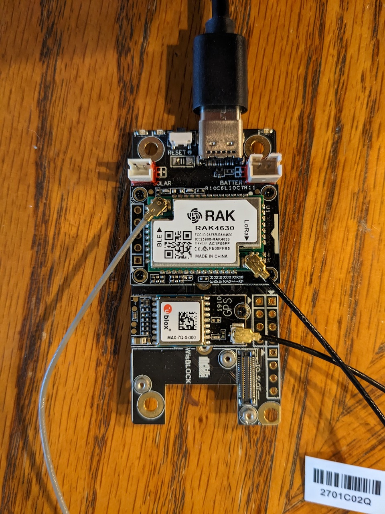

# RAK Accelerometer Test
Docs 6-10-23 V1 (For questions or comments:  Stephen Witty switty@level500.com)  

### Project Overview:
This project is a simple investigation of RAK WisBlock accelerometer capability.  As a base it uses sample code from RAK that can be found here:

https://docs.rakwireless.com/Product-Categories/WisBlock/RAK1904/Quickstart/#software-configuration-and-example

Modifications were made to blink the built-in green LED when movement is detected.  Raw accelerometer values are also displayed via the serial port. 

This project should be considered demo/POC quality.

### Hardware:
- RAK4630 - MCU
- RAK5005-O - Baseboard
- RAK1904 - Accelerometer module

### Demo Video:
https://www.youtube.com/watch?v=yBtk06jVo5Y

